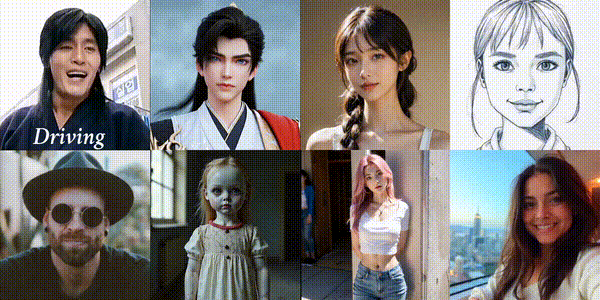
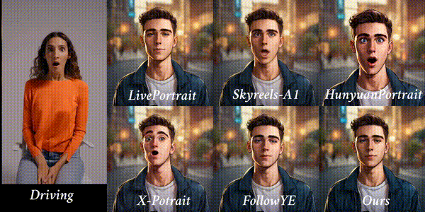
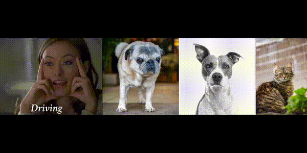
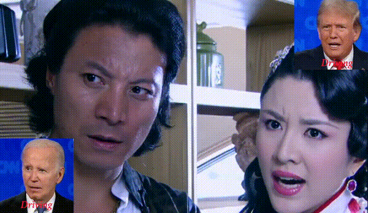
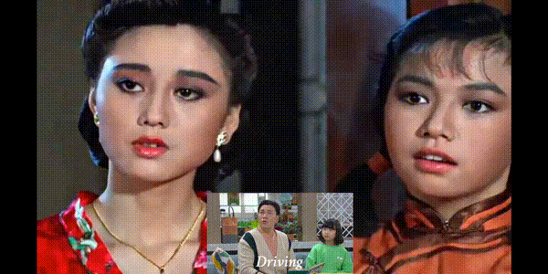

[中文阅读](./README_zh.md)
# FantasyPortrait: Enhancing Multi-Character Portrait Animation with Expression-Augmented Diffusion Transformers

[](https://fantasy-amap.github.io/fantasy-portrait/)
[](https://arxiv.org/abs/2507.12956)
[](https://huggingface.co/datasets/acvlab/FantasyPortrait)
[](https://huggingface.co/acvlab/FantasyPortrait)
[](https://huggingface.co/papers/2507.12956)
[](https://modelscope.cn/models/amap_cvlab/FantasyPortrait)
[](https://www.modelscope.cn/datasets/amap_cvlab/FantasyPortrait-Multi-Expr)

## 🔥 Latest News!!
* August 12, 2025: We released the inference code, model weights and datasets.

## Demo
For more interesting results, please visit our [website](https://fantasy-amap.github.io/fantasy-portrait/).

|  |  |
| :---: | :---: |
|  |  |
|  |  |


## Quickstart
### 🛠️Installation

Clone the repo:

```
git clone https://github.com/Fantasy-AMAP/fantasy-portrait.git
cd fantasy-portrait
```

Install dependencies:
```
apt-get install ffmpeg
# Ensure torch >= 2.0.0
pip install -r requirements.txt
# Note: flash attention must be installed
pip install flash_attn
```

### 📦Multi-Expr Dataset
We make public the first multi-portrait facial expression video dataset **Multi-Expr Dataset**, Please download it via the [ModelScope](https://www.modelscope.cn/datasets/amap_cvlab/FantasyPortrait-Multi-Expr) or [Huggingface](https://huggingface.co/datasets/acvlab/FantasyPortrait-Multi-Expr).

### 🧱Model Download
| Models        |                       Download Link                                           |    Notes                      |
| --------------|-------------------------------------------------------------------------------|-------------------------------|
| Wan2.1-I2V-14B-720P  |      🤗 [Huggingface](https://huggingface.co/Wan-AI/Wan2.1-I2V-14B-720P)    🤖 [ModelScope](https://www.modelscope.cn/models/Wan-AI/Wan2.1-I2V-14B-720P)     | Base model
| FantasyPortrait      |      🤗 [Huggingface](https://huggingface.co/acvlab/FantasyPortrait/)     🤖 [ModelScope](https://www.modelscope.cn/models/amap_cvlab/FantasyPortrait/)         | Our emo condition weights

Download models using huggingface-cli:
``` sh
pip install "huggingface_hub[cli]"
huggingface-cli download Wan-AI/Wan2.1-I2V-14B-720P --local-dir ./models/Wan2.1-I2V-14B-720P
huggingface-cli download acvlab/FantasyPortrait --local-dir ./models
```

Download models using modelscope-cli:
``` sh
pip install modelscope
modelscope download Wan-AI/Wan2.1-I2V-14B-720P --local_dir ./models/Wan2.1-I2V-14B-720P
modelscope download amap_cvlab/FantasyPortrait  --local_dir ./models
```

### 🔑 Single-Portrait Inference
``` sh
bash infer_single.sh
```

### 🔑 Multi-Portrait Inference
If you use input image and drive videos with multiple people, you can run as follows:
``` sh
bash infer_multi.sh
```
If you use input image with multiple people and different multiple single-human driven videos, you can run as follows:
```sh
bash infer_multi_diff.sh
```

### 📦Speed and VRAM Usage
We present a detailed table here. The model is tested on a single A100.

|`torch_dtype`|`num_persistent_param_in_dit`|Speed|Required VRAM|
|-|-|-|-|
|torch.bfloat16|None (unlimited)|15.5s/it|40G|
|torch.bfloat16|7*10**9 (7B)|32.8s/it|20G|
|torch.bfloat16|0|42.6s/it|5G|


## 🧩 Community Works
We ❤️ contributions from the open-source community! If your work has improved FantasyPortrait, please inform us.
Or you can directly e-mail [frank.jf@alibaba-inc.com](mailto://frank.jf@alibaba-inc.com). We are happy to reference your project for everyone's convenience.

## 🔗Citation
If you find this repository useful, please consider giving a star ⭐ and citation
```
@article{wang2025fantasyportrait,
  title={FantasyPortrait: Enhancing Multi-Character Portrait Animation with Expression-Augmented Diffusion Transformers},
  author={Wang, Qiang and Wang, Mengchao and Jiang, Fan and Fan, Yaqi and Qi, Yonggang and Xu, Mu},
  journal={arXiv preprint arXiv:2507.12956},
  year={2025}
}
```

## Acknowledgments
Thanks to [Wan2.1](https://github.com/Wan-Video/Wan2.1), [PD-FGC](https://github.com/Dorniwang/PD-FGC-inference) and [DiffSynth-Studio](https://github.com/modelscope/DiffSynth-Studio) for open-sourcing their models and code, which provided valuable references and support for this project. Their contributions to the open-source community are truly appreciated.
